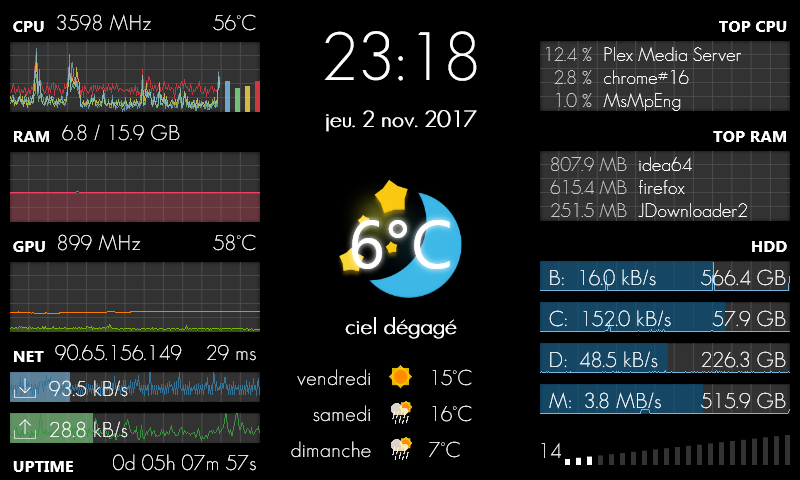

# Rainmeter GalaxyS

Special skin to be displayed on a Galaxy S connected with AirDisplay (or any 800*480 screen).

**Configure Variables.inc before launching**

Tweak date format in `Measures.inc` on line 255.

## Indicators

 * CPU clock + temperature + load
 * Quad core load graphic
 * RAM size + load
 * SWAP size + load
 * Combined RAM + SWAP load graphic
 * GPU clock + temperature + load
 * GPU load graphic
 * Uptime
 * External IP
 * Ping
 * Download bandwidth graphic
 * Upload bandwidth graphic
 * Total downloaded and uploaded
 * 3 drives usage graphic + free space
 * Weather with temperature + icon
 * Clock
 * Date
 * Volume
 
## Requirements

 * Rainmeter 3.2
 * Open Hardware Monitor
 

Weather icons from https://www.iconfinder.com/iconsets/bubbly-weather and http://rainmeter.deviantart.com/art/LG-G3-Widget-469857939.  
Weather reports from http://www.openweathermap.org.