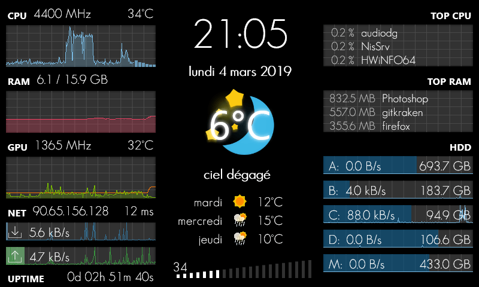

# Rainmeter GalaxyS

Special skin to be displayed on a 800*480 screen (formerly a Galaxy S connected with AirDisplay).

**Configure Variables.inc before launching**

## Indicators

 * CPU clock + temperature + load
 * RAM size + usage
 * GPU clock + temperature + load + vram
 * Uptime
 * Date
 * External IP
 * Ping
 * Download & upload bandwidth
 * Top processes by CPU and RAM usage
 * 4 drives usage bandwidth + free space
 * Volume
 * Clock
 * Weather with temperature + icon + 3-days forecast (require registration on [OpenWeatherMap](http://openweathermap.org))
 
## Requirements

 * Rainmeter 4.1
 * HWiNFO

## License

Code under MIT License.

Weather icons from https://dribbble.com/shots/2721869-Weather-icons-source-file